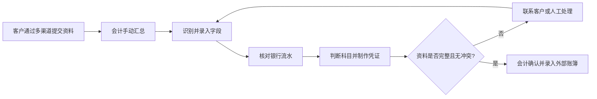
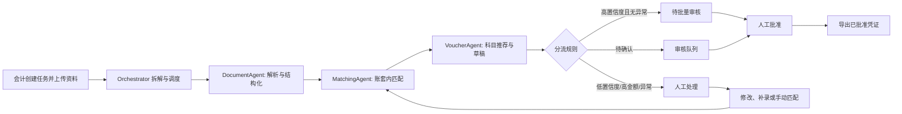

# AI 记账 Agent 产品需求文档

| 项目 | 内容 |
|---|---|
| 版本 | v1.0 |
| 日期 | 2026-07-27 |
| 产品阶段 | MVP 方案设计 |
| 目标用户 | 财务外包公司的记账会计、会计主管或审核人员 |

## 1. 背景与问题定义

财务外包会计需要同时服务数十家客户。资料通常分散在微信、邮箱和其他渠道，之后还要人工识别发票、核对银行流水、判断会计科目、录入凭证，并反复追问缺失或冲突资料。现有流程的主要问题不是“不会记账”，而是资料处理链条缺乏统一入口、判断依据分散、异常无法优先处理，导致会计把大量时间消耗在重复录入和低价值核对上。

本产品聚焦“客户已提交一批资料后”的记账准备环节：将发票、银行流水和费用单据组织为一个可追溯的记账任务，自动形成凭证草稿，并将风险明确交给人。它不试图让 AI 代替会计做最终入账决策。

### 1.1 核心问题

1. 会计无法快速判断一批资料是否齐全、哪些项目已被处理、哪些项目正在等待自己。
2. 单据、流水和科目判断在不同工具中完成，匹配关系与依据难以追溯。
3. 低置信度、金额冲突和高金额项目没有统一分流，容易被正常项目淹没。
4. 人工修改后，下游匹配和草稿容易过期，且修改原因没有形成可复盘的记录。

## 2. 产品目标与边界

### 2.1 产品目标

1. 让会计从一个账套工作台创建和跟进一项记账任务。
2. 让 Agent 将资料解析、交易匹配、科目推荐和凭证草稿生成串成可见的执行过程。
3. 让每项 AI 判断都展示原始资料、结果、置信度和判断依据。
4. 让高风险项目优先进入人工处理，正常项目可以在人工监督下批量审核。
5. 让人工修改、Agent 重新执行和最终导出形成完整审计链。

### 2.2 非目标

1. Agent 不写入正式账簿。MVP 止于人工批准凭证草稿并生成可导出凭证，正式入账由会计在外部记账系统完成。
2. 不覆盖工资核算、税务申报和资金支付。
3. 不在 MVP 中取代既有微信、邮箱渠道；会计将已收集的资料上传至任务即可。渠道自动接入是后续迭代。
4. 不在 MVP 中给出完整会计准则解释或覆盖所有行业科目。

### 2.3 成功标准

评审者无需口头说明即可从账套工作台进入一项任务，完成一条正常路径和一条金额冲突路径，并在任意凭证草稿中看到来源、置信度、依据和操作记录。

## 3. 用户与核心场景

| 角色 | 主要目标 | 核心操作 |
|---|---|---|
| 记账会计 | 快速完成资料整理和凭证准备 | 创建任务、上传资料、查看进度、处理低风险确认、编辑草稿 |
| 会计主管/审核人员 | 控制高风险与批量审核质量 | 审核高金额和异常项、批量批准、驳回并记录原因、查看审计记录 |
| 管理员 | 维护不同账套的风险边界 | 配置置信度阈值、高金额标准和账套科目映射 |
| 企业客户（可选） | 补齐资料 | 接收经人工确认的补充资料请求并重新提交资料 |

### 3.1 代表性场景

“云帆科技（上海）有限公司”的会计上传 12 份发票、8 笔银行流水和 3 张费用单据，共形成 21 个待记账处理项。DocumentAgent 完成识别，MatchingAgent 在当前账套内匹配交易，VoucherAgent 先形成 19 份草稿：18 份无异常草稿进入批量审核，1 份已生成的高金额草稿进入逐笔审核。系统另将 1 项金额冲突和 1 项科目推荐置信度低于 60% 的差旅费送入人工处理，待人工确认后再生成草稿。会计确认金额后，系统从匹配步骤重新执行并生成新草稿；会计为低置信度项目选择科目，审核人员逐笔批准冲突重跑后的新草稿和高金额草稿。所有草稿经人工批准后才能导出，AI 不写入正式账簿。

## 4. 业务流程与痛点

### 4.1 当前流程

痛点集中在 B 到 E：资料与交易的关联依赖个人记忆，异常散落在不同消息中，人工修改无法自动同步到后续步骤。

### 4.2 Agent 参与后的流程

人工不是流程末尾的“兜底按钮”，而是风险分流后的明确执行者。任何人工修改都会使受影响步骤之后的结果失效，并从最早受影响的 Agent 重新开始。

## 5. 产品架构与信息架构

### 5.1 功能架构

| 模块 | 解决的问题 | MVP 能力 |
|---|---|---|
| 账套工作台 | 多客户任务难以总览 | 客户/账套列表、任务状态、待处理计数、风险摘要 |
| 任务管理 | 资料来源与处理范围不清 | 创建任务、上传资料、资料清单、执行进度 |
| Agent 执行面板 | AI 处理过程不透明 | 当前步骤、工具调用、每步输出、失败原因、队列分流 |
| 资料识别与匹配 | 单据和流水难以对应 | 字段提取、候选交易、匹配分数、冲突和重复提示 |
| 凭证草稿 | 科目推荐缺少依据 | 借贷分录、Top-3 推荐、原始资料、置信度、编辑入口 |
| 审核工作台 | 异常与正常项混杂 | 批量批准、逐项修改、驳回、人工接管和重跑 |
| 审计记录 | AI 与人工修改无法追溯 | 操作时间、执行者、对象、前后值、判断依据、原因 |

### 5.2 原型页面对应关系

1. 客户/账套工作台
2. 新建或查看记账任务
3. Agent 执行过程与任务进度
4. 单据识别及银行流水匹配
5. 凭证草稿及 AI 推荐依据
6. 异常任务/待人工处理队列
7. 批量审核与修改
8. 任务完成结果及操作记录

## 6. Agent 工作机制

### 6.1 调度原则

Orchestrator 只负责拆解任务、调度 Agent、更新状态和维护审核队列，不识别、匹配或修改业务字段。所有业务检索均限制在当前账套内；Agent 不拥有正式账簿写入或直接向客户发送信息的权限。

### 6.2 Agent 工具矩阵

| 步骤 | 执行者 | 工具/能力 | 输入 | 输出 | 失败去向 |
|---|---|---|---|---|---|
| 建立任务 | Orchestrator | 任务状态、审计日志、队列通知 | 账套、资料清单、操作者 | 任务 ID、执行批次、待处理状态 | 显示创建失败原因，不静默创建 |
| 解析资料 | DocumentAgent | 资料接收、OCR、字段提取 | 原始文件 | 结构化字段、字段置信度、资料引用 | 字段留空、置信度为 0，转人工 |
| 匹配交易 | MatchingAgent | 当前账套交易检索、匹配规则 | 结构化资料、流水候选 | 匹配结果、候选列表、置信度、依据 | 标记未匹配或冲突，转人工 |
| 推荐科目 | VoucherAgent | 科目表、账套历史映射、草稿生成 | 已匹配交易、业务摘要 | 分录草稿、科目推荐、置信度、依据 | 提供 Top-3 推荐或失败原因，转人工 |
| 人工接管 | 会计/审核人员 | 编辑、补录、确认、驳回 | 处理项及证据 | 修改记录、重跑起点或终止原因 | 保留原结果和人工原因 |
| 导出 | 会计 | 已批准凭证导出 | 已批准草稿 | 可导出凭证文件/记录 | 导出失败可重试，不改变批准状态 |

### 6.3 每项 AI 判断的展示契约

无论是 OCR 字段、交易匹配还是科目推荐，界面均展示以下四项：

1. 原始资料引用：账套 ID、任务 ID、资料 ID、文件名和字段位置。
2. 判断或推荐结果。
3. 置信度（0–100%）。
4. 简短判断依据，例如“金额完全一致、日期相差 1 天、摘要包含‘云服务费’”。

## 7. 核心功能详细说明

### 7.1 账套工作台与任务创建

会计从客户/账套工作台选择账套，看到本月任务数、待审核数、人工处理数和最近异常。新建任务时选择账套、会计期间并上传资料；系统生成任务 ID、显示资料数量，并提供明确的“开始 Agent 执行”动作。已有任务的详情页也保留这一入口，用户无需依赖自动播放或隐藏页面才能看到首次执行过程。

验收点：创建后用户能返回工作台，且任务状态、账套归属和资料数量可见；用户能从任务详情显式启动 Agent。

### 7.2 Agent 执行面板

执行面板按 DocumentAgent、MatchingAgent、VoucherAgent 展示当前步骤、输入、输出和工具调用结果。每步完成后用结果条区分全部通过、部分通过和异常分流，例如资料识别 `23 / 23`、交易匹配 `20 项通过 / 1 项冲突`、草稿生成 `19 项完成 / 2 项待人工处理`。任务进度和人工工作数量随步骤结果刷新；失败不显示为笼统的“处理中”，而显示失败步骤、失败原因和人工入口。

验收点：用户可以解释任务当前由哪个 Agent 执行、已完成什么、产生了多少正常结果和异常结果、下一步是什么。

### 7.3 单据识别与交易匹配

识别页以资料为主对象，展示原文件引用、提取字段、字段置信度和候选银行交易。会计可以查看金额、日期、摘要三个匹配依据，选择候选交易或标记例外。金额冲突时系统并列展示所有来源值，不默认替用户选择。

验收点：用户能找到一个匹配成功项和一个金额冲突项的全部证据，并对冲突项执行人工确认。

### 7.4 凭证草稿与推荐依据

草稿页展示摘要、借贷分录、推荐科目、备选科目、置信度和依据。会计修改科目或金额后，系统保留原建议、人工修改值及理由；若修改影响匹配或金额，后续草稿标记失效并重新生成。

验收点：每份草稿都明确为“草稿”，不能出现“自动入账”动作。

### 7.5 审核工作台

审核工作台使用一个人工工作列表统一承载 1 组正常草稿批量审核和 3 个逐项处理入口，切换项目时保留任务上下文、业务步骤和队列位置。高置信度且无异常的处理项进入批量审核组；审核人员可抽查并展开单项查看证据。待确认和人工处理项需要逐项处理。批量批准前，系统展示选中数量、风险提示和将被批准的草稿范围。修改或驳回单项时，该项移出当前批量范围，其余正常草稿仍可继续批准；驳回时必须填写原因，并选择“退回重做”或“终止该项”。任务详情按全任务口径同步展示“待审核、已批准待导出、需先人工处理”数量；尚有草稿待审核时显示剩余数量，全部审核完成后改为“审核已完成，等待导出”。

验收点：正常项可以批量批准；高金额、冲突、重复和匹配失败项不能被无提示地批量跳过。

### 7.6 审计记录与完成结果

正常草稿和异常草稿可以分批导出：先导出的正常凭证不受未完成异常项影响；异常草稿逐项批准后，可生成增量导出记录，且不会重复包含此前已导出的凭证。完成页展示累计导出数量、未完成或终止项、Agent 处理统计及时间线。所有草稿审核通过但尚未导出时，任务显示“待导出”，不能提前显示“已完成”；只有所有处理项完成或终止、且所有已批准草稿均已导出时，整项任务才显示“已完成”。每条记录包含时间、账套 ID、任务 ID、执行批次 ID、操作对象、操作步骤、工具、前后值、执行者和原因。

验收点：会计可从一份凭证草稿回溯到来源资料与人工修改；审核人员可从任务记录定位一个失败步骤。

## 8. Agent 与人工职责边界

| 事项 | Agent | 人工 |
|---|---|---|
| OCR 与字段提取 | 自动执行并提供置信度 | 在失败或低置信度时补录/重传 |
| 交易匹配 | 账套内生成候选和依据 | 确认冲突、未匹配和例外 |
| 科目建议 | 推荐科目和 Top-3 备选 | 判断不确定科目、修改分录 |
| 凭证草稿 | 自动生成 | 批准、驳回、导出 |
| 正式账簿写入 | 不参与 | 在外部记账系统执行 |
| 客户补件 | 仅生成请求草稿 | 确认后发送 |
| 工资、税务、支付 | 不参与 | 人工专属 |

## 9. 状态设计

### 9.1 处理项状态

| 状态 | 进入条件 | 用户可执行操作 | 下一状态 |
|---|---|---|---|
| 处理中 | Agent 正在执行或重新执行 | 查看进度、取消任务 | 待批量审核、待确认、人工处理中 |
| 待批量审核 | 全部关键判断 ≥85%，且无异常 | 展开证据、批量批准、转人工 | 已批准待导出、人工处理中 |
| 待确认 | 最低关键判断在 60%（含）至 85%（不含），且无异常 | 确认、修改、驳回 | 已批准待导出、处理中、已终止 |
| 人工处理中 | 最低关键判断 <60%，或高金额、冲突、未匹配、重复、工具失败 | 补录、手动匹配、选择科目、标记例外 | 处理中、已终止 |
| 已批准待导出 | 草稿经人工批准 | 导出凭证 | 已完成 |
| 已完成 | 已批准凭证已导出 | 查看审计记录 | 已完成 |
| 已终止 | 人工确认不再继续该项 | 查看原因与记录 | 已终止 |

### 9.2 任务状态

| 状态 | 进入条件 | 用户看到的内容 |
|---|---|---|
| 待处理 | 任务已创建，尚未开始 | 资料清单、开始处理动作 |
| 处理中 | 至少一个处理项由 Agent 执行 | 总进度、当前 Agent、各队列数量 |
| 待人工处理 | 无 Agent 执行，且至少一个处理项等待人工操作 | 风险摘要、人工处理入口 |
| 待导出 | 所有可生成草稿均已人工批准，但至少一份已批准草稿尚未导出 | 已批准数量、导出动作、正式入账边界 |
| 已完成 | 所有处理项完成或终止，且已批准凭证已导出 | 结果摘要、导出记录、时间线 |
| 已终止 | 人工终止整项任务 | 终止原因、已保留的操作记录 |

## 10. 关键业务规则与假设

### 10.1 规则

1. 每个账套的数据、历史规则和检索结果严格隔离；Agent 不跨账套读取资料。
2. OCR、匹配、科目推荐分别计算置信度。单个处理项取所有关键判断中的最低置信度分流，不对不同类型置信度求平均。
3. 默认分流：≥85% 且无异常进入待批量审核；60%≤x<85% 进入待确认；<60% 进入人工处理中。
4. 单笔金额 ≥50,000 元、资料字段冲突、匹配失败和重复资料覆盖置信度规则，直接进入人工处理中。
5. 第一阶段匹配规则为：当前账套内优先筛选金额相同的候选交易，再比较日期是否在 ±3 天内，并使用摘要关键词作为辅助依据。无候选或多个候选无法区分时，不自动选定。
6. 重复资料通过文件指纹、发票号码、金额、日期和销方信息综合识别。仅标记为疑似重复，不自动删除原资料。
7. 人工修改会记录前后值、理由和操作者；受影响步骤之后的草稿失效，并从最早受影响步骤重新执行。
8. 审计记录只可追加，不可删除。

### 10.2 必要假设

1. MVP 面向使用人民币、常见费用和采购业务的中小企业，先维护约 50 个常用一、二级科目。
2. 每个账套由管理员独立配置高金额阈值、置信度阈值和历史科目映射；本 PRD 采用 50,000 元、85% 和 60% 作为默认示例。
3. 演示原型使用虚构客户、资料和金额，不代表真实会计结论。
4. 系统只生成凭证草稿及导出文件，外部账簿系统是正式入账的唯一写入点。

### 10.3 假设来源与待验证问题

本方案的业务边界来自作业题目给定的角色、流程和设计约束；具体阈值、匹配规则和科目范围是为了完成 MVP 演示而做的合理假设，尚未经过真实财务外包公司的用户访谈或历史业务数据验证。试点阶段需要回答以下问题：

| 当前假设 | 试点时如何验证 |
|---|---|
| 会计适合以“账套 + 会计期间 + 资料批次”创建任务 | 访谈记账会计，核对实际交接粒度、补件方式和月末并发量 |
| 85%、60% 和 50,000 元适合作为默认分流线 | 用历史已审核样本回放，比较错误放行率、人工处理占比和不同账套的风险偏好 |
| 金额、±3 天日期和摘要关键词足以支持第一阶段匹配 | 抽取真实单据与流水测试候选召回率和首位匹配准确率，重点检查延迟付款和合并付款 |
| 约 50 个常用一、二级科目能覆盖首版客户 | 统计试点账套的历史凭证科目覆盖率和人工新增科目频次 |
| 审核人员能依据原始资料、置信度和简短依据完成审批 | 记录审核时长、展开原文频次、驳回原因和访谈反馈，判断证据是否足够 |
| 导出结果可被现有记账系统接收 | 与目标记账系统的字段、科目编码和批量导入格式做映射测试 |

## 11. 异常处理与人工接管

| 异常 | Agent 行为 | 人工操作 | 后续处理 |
|---|---|---|---|
| OCR 识别失败 | 字段留空、置信度为 0、明确失败原因 | 手动录入或重新上传 | 从 DocumentAgent 重新执行，下游结果失效 |
| 金额不一致 | 并列展示所有来源值，不自动选择 | 确认正确金额 | 从 MatchingAgent 重新执行并更新草稿 |
| 无匹配交易 | 保留资料、标记未匹配 | 手动匹配或标记例外 | 匹配后重新执行 VoucherAgent；例外项结案 |
| 重复资料 | 标记疑似重复，不生成重复草稿 | 确认是否同一笔 | 确认为重复则结案，否则继续匹配 |
| 科目不确定 | 展示 Top-3 推荐与依据 | 选择或手动填写 | 更新草稿后再次进入审核 |
| 客户资料缺失 | 生成补件请求草稿 | 确认后发送 | 新资料返回后从 DocumentAgent 重新执行 |
| 工具调用失败 | 展示失败步骤和原因 | 重试或转人工 | 保留已完成步骤，不静默跳过 |

## 12. 数据指标与效果评估

| 目标 | 指标 | 计算方式 | 数据来源 | 统计周期 |
|---|---|---|---|---|
| 提升效率 | 单任务处理时长 | 任务完成时间 - 创建时间 | 任务记录 | 每周/每月 |
| 降低人工负担 | 人工处理队列占比 | 人工处理项数 / 全部处理项数 | 处理项状态 | 每月 |
| 提升准确性 | 交易匹配准确率 | 经人工确认正确的匹配数 / 已审核匹配数 | 审核结果 | 每月 |
| 提升草稿质量 | 一次审核通过率 | 未修改即批准草稿数 / 已审核草稿数 | 草稿与审核记录 | 每月 |
| 控制风险 | 高金额审核覆盖率 | 已人工审核的高金额项 / 高金额项总数 | 风险队列 | 每月 |
| 支持追溯 | 追溯信息完整率 | 具备来源、结果、置信度、依据和日志的 AI 判断数 / AI 判断总数 | 审计记录 | 每周 |

上线初期先记录试点基线，不在没有历史数据的情况下承诺不可信的效率或准确率目标。

## 13. 风险与后续迭代

| 风险 | 影响 | MVP 控制措施 | 后续迭代 |
|---|---|---|---|
| OCR 或匹配错误 | 错误草稿、人工返工 | 逐项置信度、异常升级、原始资料可见 | 接入账套级纠错规则和高质量 OCR |
| 会计过度信任 AI | 未核对即批准 | 草稿标识、依据展示、第一阶段不跳过人工确认 | 基于审核历史逐步开放人工批量确认 |
| 多账套数据串读 | 合规和保密风险 | 所有检索带账套边界、审计记录账套 ID | 权限模型与隔离审计 |
| 规则过度复杂 | 交付周期长、难维护 | 先支持常见科目与规则匹配 | 引入行业模板和可配置规则库 |
| 客户资料不完整 | 任务长期卡住 | 补件草稿、显式等待状态 | 客户协作门户和渠道自动收件 |

优先级顺序为：先完成可追溯资料处理、风险分流和草稿审核闭环；再扩展渠道接入、账套规则学习和客户协作。
